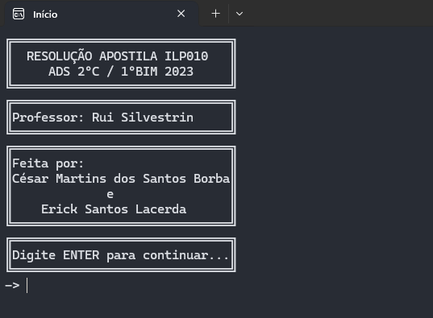
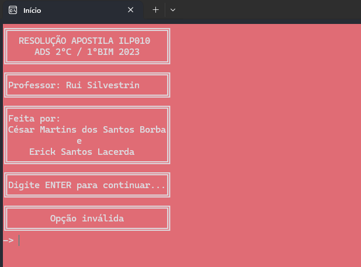
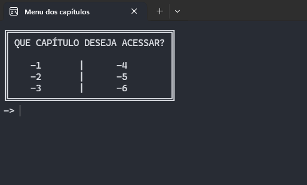
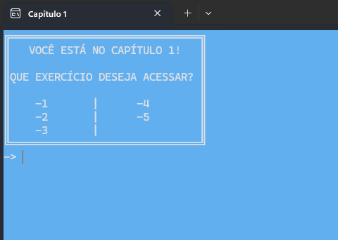
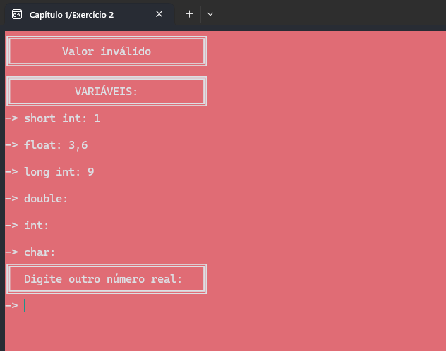
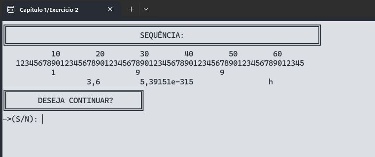
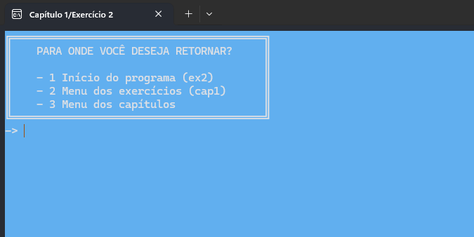

# <strong>Menu switch</strong> de resolução de exercícios em C

Projeto desenvolvido parcialmente no 2º semestre da faculdade de ADS - FATEC BS, objetivo do projeto era criar um menu switch com fluxo restrito de telas, no qual permitia o usuário navegar por todos os exercícios apresentados pelo professor Ruy Silvestrin e nossas resoluções postas em práticas.

Atualmente parte do projeto encontra-se não finalizado, contudo o projeto mantém-se estruturado para uma futura possível continuação.

###### INÍCIO

###### SWITCH - CAPÍTULOS

###### EXERCÍCIOS

###### SWITCH - REDIRECIONAMENTO

